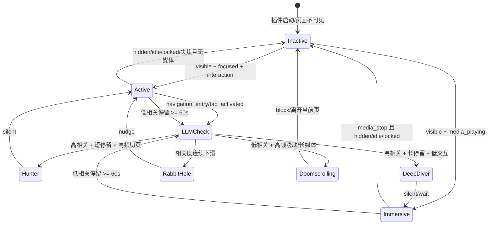

# 技术架构文档

**Date**: 2026/04/13
**Status**: 规划阶段

---

## 核心设计原则

**"小脑+脊髓"架构**：代码 API 负责高频条件反射（时间记录、可见性检测），LLM 负责低频复杂语义决策（意图匹配、干预策略）。

---

## 系统架构

```
┌─────────────────────────────────────────────────────────────┐
│                    Browser Extension (MV3)                    │
├─────────────────────────────────────────────────────────────┤
│  ┌──────────────┐    ┌──────────────┐    ┌──────────────┐   │
│  │ Content      │───▶│ Background   │───▶│ LLM API      │   │
│  │ Script       │    │ Service      │    │ (DeepSeek/   │   │
│  │ (Perception) │    │ Worker       │    │ OpenAI/Ollama│   │
│  └──────────────┘    │ (State       │    └──────────────┘   │
│  │                   │  Machine)     │                       │
│  │                   └──────────────┘                       │
│  │                           │                              │
│  ▼                           ▼                              │
│  ┌──────────────┐    ┌──────────────┐                       │
│  │ IndexedDB    │◀───│ Daily Review│                       │
│  │ (Local       │    │ Dashboard   │                       │
│  │  History)    │    │ (ECharts)   │                       │
│  └──────────────┘    └──────────────┘                       │
└─────────────────────────────────────────────────────────────┘
```

---

## 模块设计

### 1. Perception Layer（内容脚本）

**职责**：环境感知，收集物理状态数据。

**实现**：
- `visibilitychange` 监听 → 页面可见性
- `mousemove/keydown/wheel` 事件 → 键鼠活跃度（防抖处理）
- `<video>/<audio>` 标签状态 → 媒体播放检测
- `webNavigation.transitionType` → 页面跳转方式（`typed/link/reload`）
- 提取 Title、Meta description、首段文本

**心跳机制**：每 10 秒根据当前状态向 Background 发送 Active/Immersive 心跳，并更新滑动窗口日志。

**统一事件格式（感知层 -> 状态机）**：
```json
{
  "timestamp": "2026-04-13T12:00:00.000Z",
  "tabId": 1024,
  "pageContext": {
    "url": "https://example.com",
    "title": "Example",
    "meta": "..."
  },
  "behavior": {
    "actionType": "navigation_entry",
    "transitionType": "link",
    "visibilityState": "visible",
    "windowFocused": true,
    "idleState": "active",
    "hasMedia": false,
    "interactionIntensity": "medium"
  }
}
```

---

### 2. State Machine（后台 Service Worker）

**职责**：维护注意力状态机，先做本地判定，再在必要时触发 LLM 深度诊断。

**L1 物理注意力状态（代码实时判定）**：

| 状态 | 条件 | 计入专注时间 |
|------|------|-------------|
| Active | 页面可见 + 窗口有焦点 + 键鼠活动 | ✅ |
| Immersive | 页面可见 + 视频/音频播放中 | ✅ |
| Inactive | 页面隐藏 / chrome.idle 超 60s / 窗口失焦且无媒体 | ❌ |

**L2 认知状态（LLM 语义判定）**：

| 认知状态 | 数据形状 | 处理策略 |
|---------|---------|---------|
| Hunter（狙击式搜索） | 高频切页 + 高相关 + 短停留 | 静默 |
| Deep Diver（沉浸式深潜） | 高相关 + 长停留 + 低交互 | 静默/延迟提醒 |
| Rabbit Hole（兔子洞） | 链式跳转 + 相关度阶梯下滑 | nudge |
| Doomscrolling（自动驾驶） | 低相关 + 高频滚动或长媒体播放 | block |

**新的状态判断流程（事件驱动 + 阈值触发）**：

1. 静默记账：所有浏览行为先写入本地滑动窗口（最近 5 分钟/最近 N 条）。
2. 进门安检：`navigation_entry` 或 `tab_activated` 触发轻量判定（域名白名单 + 标题语义）。
3. 物理状态归因：根据 `visible/focus/idle/media` 将 tab 归为 `Active/Immersive/Inactive`。
4. 阈值升级：当页面低相关且 `Active/Immersive` 持续 >= 60s，触发 LLM 深度诊断（带上 recent logs）。
5. 动作执行：根据 LLM 返回 `wait/silent/nudge/block` 控制干预强度，并回写结果用于后续复盘。

**状态流转图**：



---

### 3. LLM Interaction Layer

**输入 JSON 结构**：
```json
{
  "user_goal": "写一段 Python 爬虫代码",
  "current_page": {
    "url": "https://www.bilibili.com/video/xxx",
    "title": "游戏解说：本周热门",
    "meta": "...",
    "stay_time_seconds": 92,
    "transition_type": "typed"
  },
  "runtime_state": {
    "attention_state": "immersive",
    "visibility_state": "visible",
    "idle_state": "active",
    "has_media": true,
    "interaction_intensity": "low"
  },
  "recent_logs": [
    {
      "timestamp": "2026-04-13T11:58:10.000Z",
      "title": "LLM Agent 编排实战",
      "llm_relevance": 4.6
    },
    {
      "timestamp": "2026-04-13T11:59:40.000Z",
      "title": "Bilibili - 热门视频推荐",
      "llm_relevance": 0.8
    }
  ]
}
```

**输出**：偏离指数（1-5）+ 认知状态 + 干预指令（wait/silent/nudge/block）

**Prompt 设计哲学**：领航员视角，觉察+核对+引导，不评判用户"意志力薄弱"。

---

### 4. Local Storage（IndexedDB）

**数据模型**：
```typescript
interface BrowsingRecord {
  id: string;
  timestamp: number;
  url: string;
  title: string;
  goal: string;
  attention_state: 'active' | 'immersive' | 'inactive';
  cognitive_state?: 'hunter' | 'deep_diver' | 'rabbit_hole' | 'doomscrolling';
  transition_type?: 'typed' | 'link' | 'reload' | 'auto_bookmark';
  deviation_index: number;  // 1-5
  stay_duration: number;    // 秒
  intervention_type: 'silent' | 'nudge' | 'block';
  user_feedback?: 'up' | 'down';
}
```

**读写分离**：
- 实时干预：读取最近 3-5 条记录（滑动窗口）
- 每日复盘：全量读取，使用不同的 Prompt 生成"漫游日记"

---

## 技术栈选型

| 模块 | 推荐方案 | 备注 |
|------|---------|------|
| 插件框架 | WXT 或 Plasmo | 原生支持 MV3，简化 manifest 管理 |
| AI 推理 | WebLLM (MLC LLM) | 可选本地推理，终极隐私 |
| AI SDK | Vercel AI SDK 或 LangChain.js | 流式交互，滑动窗口管理 |
| 本地存储 | IndexedDB | Dexie.js 封装简化操作 |
| 图表 | ECharts | 轻量级注意力分布可视化 |

---

## API 调用策略（事件驱动 + 多层级决策）

```
┌────────────────────────────────────────┐
│  Layer 1: 本地白名单判断                │ ← 毫秒级，零成本
│  (域名匹配 → 直接放行)                  │
└────────────────┬───────────────────────┘
                 ▼
┌────────────────────────────────────────┐
│  Layer 2: 嵌入向量相似度（可选）        │ ← 快速，低成本
│  (本地轻量 Embedding 模型)              │
└────────────────┬───────────────────────┘
                 ▼
┌────────────────────────────────────────┐
│  Layer 3: LLM 深度语义理解              │ ← 有延迟，有成本
│  (偏离指数 + 干预策略)                  │
└────────────────────────────────────────┘
```

**触发矩阵（替代固定定时轮询）**：

| 触发事件 | 判定层级 | 请求内容 | 目标 |
|---------|---------|---------|------|
| `navigation_entry` / `tab_activated` | Layer 1 -> Layer 2 | 当前页标题/Meta/URL（轻量） | 进门安检 |
| 低相关页停留 >= 60s 且 Active/Immersive | Layer 3 | 最近 5 分钟 `recent_logs` + 行为状态 | 深度诊断与干预 |
| 每日复盘任务 | 离线批处理 | 当天全量 BrowsingRecord | 日报与策略优化 |

---

## 权限清单（Manifest V3）

```json
{
  "permissions": ["idle", "tabs", "storage", "webNavigation"],
  "host_permissions": ["<all_urls>"]
}
```

**不申请**：`system.display`（多显示器检测非核心功能，且易引发隐私审核）

---

## BYOK vs 订阅模式架构差异

### BYOK 模式（阶段一）
```
用户浏览器 → 直接请求 → DeepSeek/OpenAI API
（零后端，零成本，零数据留存）
```

### 订阅模式（阶段三）
```
用户浏览器 → 我们的无状态网关 → DeepSeek/OpenAI API
（网关仅转发，不存储浏览明细）
```
